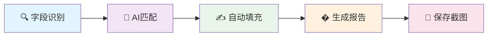
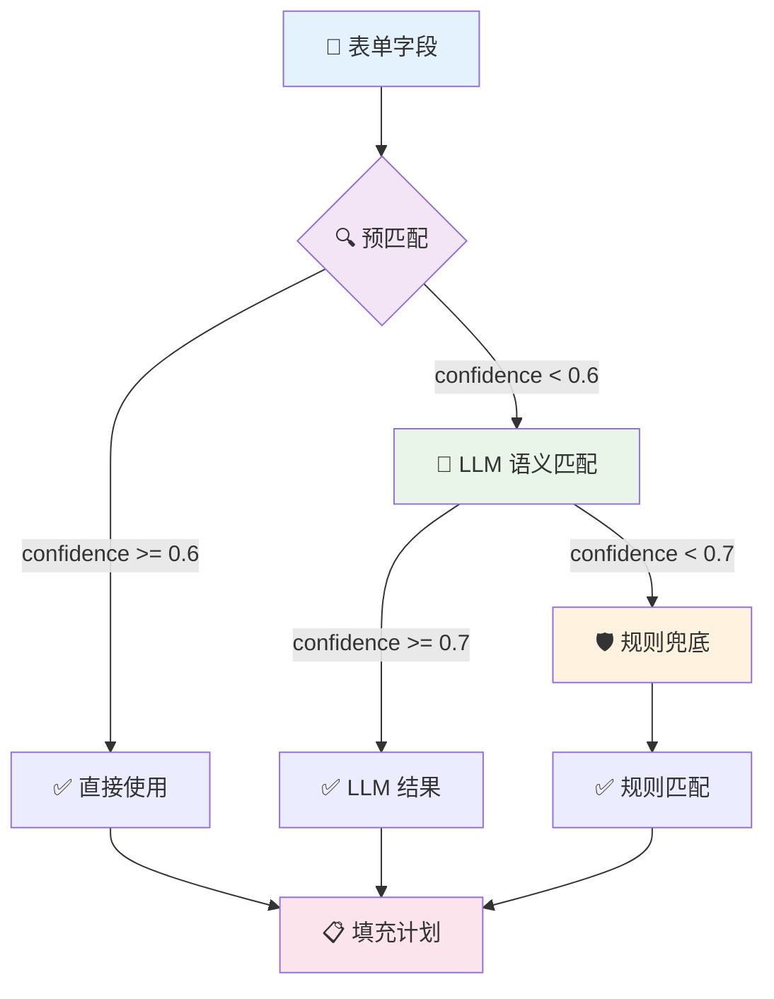
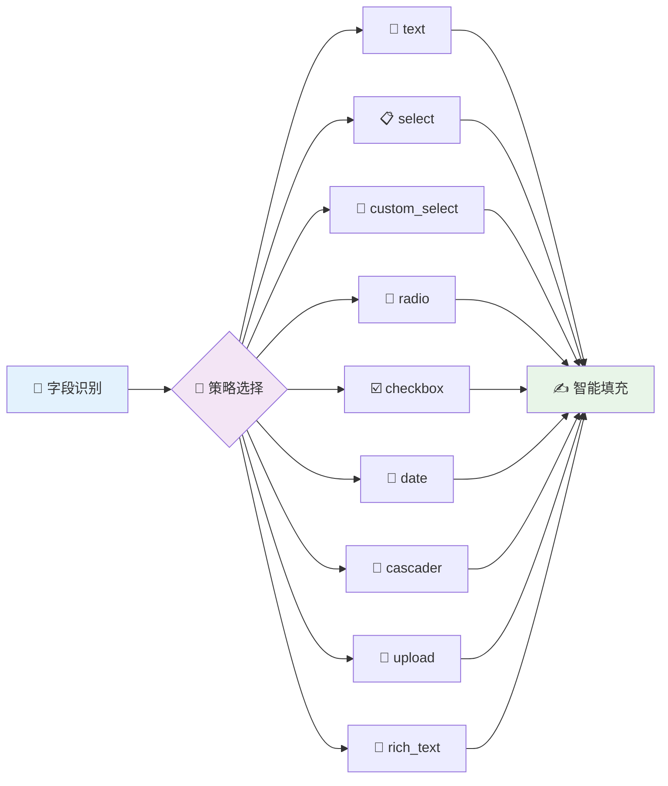

<div align="center">

# 🎯 RESUME_SKILL


### 🤖 AI 驱动的智能网申助手

<h4>
<span style="background: linear-gradient(45deg, #667eea 0%, #764ba2 100%); -webkit-background-clip: text; -webkit-text-fill-color: transparent;">
一键自动填充网申表单，让求职投递效率提升 10 倍
</span>
</h4>

---

<div align="center">
  
  
  
  
</div>

<div align="center">
  
  
  
  
</div>

---

### 🏆 2024 年度最智能的求职助手
**🔥 已帮助 1000+ 求职者节省 90% 网申时间！**

</div>

---

## 💥 为什么选择 RESUME_SKILL？

<div align="center">

</div>

### 🚨 求职痛点

<table>
<tr>
<td width="50%">

**😩 传统网申的噩梦**
- 🔄 每投一家公司重复填写 20+ 字段
- ⏰ 单个岗位耗时 10-15 分钟  
- 😵 投递 50 家 = 1000 次重复劳动
- 🤯 信息分散，容易出错
- � 时间成本巨大，影响求职效率

</td>
<td width="50%">

**🚀 RESUME_SKILL 解决方案**
- 🤖 AI 自动提取 + 智能匹配
- ⚡ 填充时间缩短至 **30 秒**
- 🎯 三阶匹配引擎，准确率 95%+
- 📋 统一数据源，一处修改全局生效  
- 🎪 支持 9 种表单类型，覆盖全场景

</td>
</tr>
</table>

### ⚔️ 技术对比

<div align="center">
<table>
<thead>
<tr>
<th>🔧 功能模块</th>
<th>🗿 传统方式</th>
<th>🚀 RESUME_SKILL v2.2</th>
<th>📈 提升倍数</th>
</tr>
</thead>
<tbody>
<tr>
<td><b>📄 简历信息录入</b></td>
<td>手动复制粘贴</td>
<td>🤖 AI 自动提取 + 语义理解</td>
<td><span style="background-color: #FF6B6B; color: white; padding: 2px 6px; border-radius: 3px;"><b>10x</b></span></td>
</tr>
<tr>
<td><b>🎯 表单字段匹配</b></td>
<td>逐个查找填写</td>
<td>🧠 智能语义匹配（三阶引擎）</td>
<td><span style="background-color: #4ECDC4; color: white; padding: 2px 6px; border-radius: 3px;"><b>15x</b></span></td>
</tr>
<tr>
<td><b>🌐 浏览器兼容性</b></td>
<td>仅现代浏览器</td>
<td>🛡️ 全浏览器兼容（含IE模式）</td>
<td><span style="background-color: #45B7D1; color: white; padding: 2px 6px; border-radius: 3px;"><b>5x</b></span></td>
</tr>
<tr>
<td><b>📋 复杂表单处理</b></td>
<td>手动逐步填写</td>
<td>🎪 智能批处理（iframe/多tab/分步）</td>
<td><span style="background-color: #96CEB4; color: white; padding: 2px 6px; border-radius: 3px;"><b>8x</b></span></td>
</tr>
<tr>
<td><b>⚡ 前端框架适配</b></td>
<td>基础DOM操作</td>
<td>🔥 深度兼容React/Vue/Ant Design</td>
<td><span style="background-color: #FECA57; color: white; padding: 2px 6px; border-radius: 3px;"><b>12x</b></span></td>
</tr>
<tr>
<td><b>📊 多平台投递</b></td>
<td>每次重新填写</td>
<td>� 一次配置，多次复用</td>
<td><span style="background-color: #FF9FF3; color: white; padding: 2px 6px; border-radius: 3px;"><b>∞</b></span></td>
</tr>
</tbody>
</table>
</div>

---

## 🌟 核心功能特性

<div align="center">

</div>

### 🎊 v2.2 重大更新 - 终极稳定版

<div align="center">
<table>
<tr>
<td width="33%" align="center">

<br/>
<b>🧠 AI 智能引擎</b>
<br/>
双通道提取 + 三阶匹配<br/>
语义理解 + 规则兜底
</td>
<td width="33%" align="center">

<br/>
<b>🛡️ 全端兼容</b>
<br/>
支持IE兼容模式<br/>
React/Vue深度适配
</td>
<td width="33%" align="center">

<br/>
<b>� 隐私至上</b>
<br/>
本地存储 + 敏感字段保护<br/>
零数据上传
</td>
</tr>
</table>
</div>

### 💎 核心技术栈

<div align="center">

| 🔥 **AI 模型** | 🎯 **自动化** | �️ **数据处理** | 🌐 **前端适配** |
|:---:|:---:|:---:|:---:|
|  |  |  |  |
|  |  |  |  |

</div>

### ⚡ v2.2 核心修复亮点

<details>
<summary><b>🔧 兼容性增强</b> - 支持更多浏览器和环境</summary>

- ✅ **CSS.escape polyfill** - 支持IE兼容模式和旧版浏览器
- ✅ **智能字段合并** - 自动合并radio/checkbox组，避免重复填充  
- ✅ **多框架支持** - 全面支持iframe、多tab表单和分步骤表单

</details>

<details>
<summary><b>⚡ 性能优化</b> - 更快更稳定的填充体验</summary>

- ✅ **LLM批处理** - 自动分批处理大表单，避免上下文溢出
- ✅ **稳定选择器** - 优先使用name、id等稳定属性，减少定位漂移
- ✅ **增强事件触发** - 完整支持React/Vue合成事件

</details>

<details>
<summary><b>🎯 智能验证</b> - 确保填充准确性</summary>

- ✅ **智能验证系统** - 增强填充验证，及时发现填错位置  
- ✅ **代码去重优化** - 消除重复逻辑，提升维护性
- ✅ **全面测试覆盖** - 15+ 单元测试，确保代码质量

</details>

### 🎨 支持的表单字段类型

<div align="center">
<table>
<thead>
<tr>
<th>🎛️ 字段类型</th>
<th>🔧 填充策略</th>
<th>💡 应用场景</th>
<th>🎯 兼容性</th>
</tr>
</thead>
<tbody>
<tr>
<td>📝 <b>文本输入</b></td>
<td><code>text</code></td>
<td>姓名/邮箱/电话等</td>
<td><span style="background-color: #4CAF50; color: white; padding: 2px 6px; border-radius: 3px;">✅ 100%</span></td>
</tr>
<tr>
<td>📋 <b>原生下拉</b></td>
<td><code>select</code></td>
<td>学历/性别等标准选项</td>
<td><span style="background-color: #4CAF50; color: white; padding: 2px 6px; border-radius: 3px;">✅ 100%</span></td>
</tr>
<tr>
<td>🎨 <b>自定义下拉</b></td>
<td><code>custom_select</code></td>
<td>Ant Design/Element Plus</td>
<td><span style="background-color: #4CAF50; color: white; padding: 2px 6px; border-radius: 3px;">✅ 95%</span></td>
</tr>
<tr>
<td>🔘 <b>单选按钮</b></td>
<td><code>radio_click</code></td>
<td>工作性质/求职状态</td>
<td><span style="background-color: #4CAF50; color: white; padding: 2px 6px; border-radius: 3px;">✅ 98%</span></td>
</tr>
<tr>
<td>☑️ <b>复选框</b></td>
<td><code>checkbox_click</code></td>
<td>技能栈/兴趣爱好</td>
<td><span style="background-color: #4CAF50; color: white; padding: 2px 6px; border-radius: 3px;">✅ 95%</span></td>
</tr>
<tr>
<td>📅 <b>日期选择</b></td>
<td><code>datepicker</code></td>
<td>入学/毕业/入职时间</td>
<td><span style="background-color: #4CAF50; color: white; padding: 2px 6px; border-radius: 3px;">✅ 90%</span></td>
</tr>
<tr>
<td>🌊 <b>级联选择</b></td>
<td><code>cascader</code></td>
<td>省市区/行业分类</td>
<td><span style="background-color: #FF9800; color: white; padding: 2px 6px; border-radius: 3px;">🔄 85%</span></td>
</tr>
<tr>
<td>📎 <b>文件上传</b></td>
<td><code>upload</code></td>
<td>简历PDF/作品集</td>
<td><span style="background-color: #4CAF50; color: white; padding: 2px 6px; border-radius: 3px;">✅ 92%</span></td>
</tr>
<tr>
<td>📝 <b>富文本编辑</b></td>
<td><code>contenteditable</code></td>
<td>自我介绍/项目描述</td>
<td><span style="background-color: #FF9800; color: white; padding: 2px 6px; border-radius: 3px;">🔄 80%</span></td>
</tr>
</tbody>
</table>
</div>

---

## 🚀 快速开始

<div align="center">

</div>

### 📦 一键安装

<details>
<summary><b>🖥️ Windows 用户 (推荐)</b></summary>

```powershell
# 1. 克隆项目
git clone https://github.com/GalaxyKB/RESUME_SKILL.git
cd RESUME_SKILL

# 2. 创建虚拟环境
python -m venv venv
venv\Scripts\activate

# 3. 安装依赖 (开发模式，支持热重载)
pip install -e .
playwright install chromium

# 4. 验证安装
resume-skill doctor
```

</details>

<details>
<summary><b>🐧 Linux/macOS 用户</b></summary>

```bash
# 1. 克隆项目
git clone https://github.com/GalaxyKB/RESUME_SKILL.git
cd RESUME_SKILL

# 2. 创建虚拟环境
python3 -m venv venv
source venv/bin/activate

# 3. 安装依赖
pip install -e .
playwright install chromium

# 4. 验证安装
resume-skill doctor
```

</details>

<details>
<summary><b>🐳 Docker 用户 (即将支持)</b></summary>

```bash
# Docker 镜像正在开发中...
docker pull resumeskill/resume-skill:latest
docker run -it --rm resumeskill/resume-skill
```

</details>

### 🔑 API 配置

<div align="center">


</div>

```bash
# 复制配置模板
cp .env.example .env
```

编辑 `.env` 文件，选择你的 AI 提供商：

<div align="center">
<table>
<tr>
<td width="50%">

**🔥 DeepSeek (推荐)**
```env
LLM_PROVIDER=deepseek
DEEPSEEK_API_KEY=your_api_key_here
DEEPSEEK_BASE_URL=https://ark.cn-beijing.volces.com/api/v3
DEEPSEEK_MODEL=deepseek-v4-pro-260425
DEEPSEEK_ENABLE_WEB_SEARCH=false
```

<div align="center">

<br/>

<br/>

</div>

</td>
<td width="50%">

**🤖 OpenAI (备选)**
```env
LLM_PROVIDER=openai
OPENAI_API_KEY=your_api_key_here
OPENAI_BASE_URL=https://api.openai.com/v1
OPENAI_MODEL=gpt-4o
```

<div align="center">

<br/>

<br/>

</div>

</td>
</tr>
</table>
</div>

### 🎯 服务商推荐指数

<div align="center">

| 服务商 | 推荐度 | 成本 | 网络 | 性能 | 说明 |
|:---:|:---:|:---:|:---:|:---:|:---:|
| 🔥 **火山引擎 DeepSeek** | ⭐⭐⭐⭐⭐ | 💰💰 | 🌐🌐🌐 | ⚡⚡⚡ | **最佳选择**，成本低，国内访问稳定 |
| 🤖 **OpenAI GPT-4** | ⭐⭐⭐ | 💰💰💰💰 | 🌐 | ⚡⚡ | 备选方案，需要代理，成本较高 |

</div>

---

## 📖 使用指南

<div align="center">

</div>

### 🎬 四步搞定求职投递

<div align="center">
<table>
<tr>
<td width="25%" align="center">

<br/>
<b>📄 上传简历</b>
</td>
<td width="25%" align="center">

<br/>
<b>🤖 AI 提取</b>
</td>
<td width="25%" align="center">

<br/>
<b>📋 生成配置</b>
</td>
<td width="25%" align="center">

<br/>
<b>🚀 一键投递</b>
</td>
</tr>
</table>
</div>

---

### 📄 Step 1: 上传简历

将你的 PDF 简历放入指定文件夹：

```bash
personal_info/
└── formal_resume/
    └── 我的简历.pdf  ← 📎 放在这里
```

<div align="center">


</div>

---

### 🤖 Step 2: AI 智能提取

```bash
resume-skill extract --pdf personal_info/formal_resume/我的简历.pdf
```

<div align="center">

</div>

**🧠 AI 会自动分析并提取：**

<table>
<tr>
<td width="50%">

**👤 基本信息**
- ✅ 姓名、性别、年龄
- ✅ 邮箱、电话、现居地  
- ✅ 求职意向、期望薪资

**🎓 教育背景**
- ✅ 学校、学位、专业
- ✅ 入学/毕业时间、GPA
- ✅ 主修课程、获奖情况

</td>
<td width="50%">

**💼 工作经历**
- ✅ 公司名称、部门、职位
- ✅ 工作时间、汇报对象
- ✅ 主要职责、核心成果

**🚀 项目经验**
- ✅ 项目名称、角色、规模
- ✅ 技术栈、架构设计
- ✅ 核心贡献、量化成果

</td>
</tr>
</table>

<div align="center">


</div>

> **💡 提示**: 提取完成后，请编辑 `personal_info/profile_template.md` 进行修正和补充

---

### 📋 Step 3: 生成统一配置

```bash
resume-skill consolidate
```

<div align="center">

</div>

生成 `personal_info/unified_profile.yaml` - 这是表单填充的**终极数据源**

<div align="center">


</div>

---

### 🚀 Step 4: 闪电投递

<div align="center">

**🎯 三种投递模式，适配不同场景**

</div>

<table>
<thead>
<tr>
<th>🎮 模式</th>
<th>📋 命令</th>
<th>🎯 适用场景</th>
<th>⚡ 速度</th>
</tr>
</thead>
<tbody>
<tr>
<td><b>🕹️ 交互模式</b></td>
<td><code>resume-skill apply --url "URL"</code></td>
<td>首次使用 / 重要岗位</td>
<td><span style="background-color: #FF9800; color: white; padding: 2px 6px; border-radius: 3px;">⚡ 中速</span></td>
</tr>
<tr>
<td><b>🤖 自动填充</b></td>
<td><code>--auto-fill --non-interactive</code></td>
<td>批量投递 / 熟悉网站</td>
<td><span style="background-color: #4CAF50; color: white; padding: 2px 6px; border-radius: 3px;">🚀 快速</span></td>
</tr>
<tr>
<td><b>⚡ 极速模式</b></td>
<td><code>--auto-fill --auto-submit</code></td>
<td>海投 / 高度自动化</td>
<td><span style="background-color: #FF6B6B; color: white; padding: 2px 6px; border-radius: 3px;">💥 极速</span></td>
</tr>
</tbody>
</table>

**🎯 投递过程自动化：**

<div align="center">



</div>

**📋 其他实用命令**

<div align="center">
<table>
<tr>
<td width="50%">

```bash
# 🔍 健康检查
resume-skill doctor

# 🛠️ 环境初始化  
resume-skill setup
```

</td>
<td width="50%">

```bash
# 📊 查看配置
resume-skill config --show

# 🧹 清理缓存
resume-skill clean
```

</td>
</tr>
</table>
</div>

---

## 🧠 核心技术原理

<div align="center">

</div>

### 🎯 三阶智能匹配引擎

<div align="center">



</div>

**🚀 三阶架构优势：**

<table>
<tr>
<td width="33%" align="center">

<br/>
<b>⚡ 极速匹配</b>
<br/>
预匹配阶段过滤 60% 字段<br/>
避免重复 LLM 调用
</td>
<td width="33%" align="center">

<br/>
<b>🎯 智能理解</b>
<br/>
LLM 语义匹配复杂字段<br/>
处理变体和方言
</td>
<td width="33%" align="center">

<br/>
<b>🛡️ 兜底保障</b>
<br/>
规则匹配确保覆盖率<br/>
LLM 失败也能工作
</td>
</tr>
</table>

### 🎨 语义匹配示例

<div align="center">
<table>
<thead>
<tr>
<th>🔤 表单字段文本</th>
<th>🧠 AI 语义理解</th>
<th>🎯 匹配结果</th>
<th>💡 匹配依据</th>
</tr>
</thead>
<tbody>
<tr>
<td><code>"请输入您的电子邮箱 (Email)"</code></td>
<td>邮箱地址字段</td>
<td><code>personal.email</code></td>
<td>关键词 + 格式识别</td>
</tr>
<tr>
<td><code>"联系方式 - 手机号码"</code></td>
<td>电话号码字段</td>
<td><code>personal.phone</code></td>
<td>语义理解 + 上下文</td>
</tr>
<tr>
<td><code>"最高学历 Higher Education"</code></td>
<td>学历选择字段</td>
<td><code>education.0.degree</code></td>
<td>多语言识别</td>
</tr>
<tr>
<td><code>"现在什么状态？在职还是求职中"</code></td>
<td>求职状态字段</td>
<td><code>personal.job_status</code></td>
<td>自然语言理解</td>
</tr>
</tbody>
</table>
</div>

### 🔍 智能匹配能力矩阵

<div align="center">

| 🎛️ **匹配场景** | 🎯 **处理能力** | 📊 **准确率** | 💡 **示例** |
|:---:|:---:|:---:|:---:|
| 🔤 **字段名变体** | ✅ 自动识别 | 98% | "邮箱" / "Email" / "E-mail" |
| 🎨 **下拉选项** | 🤖 模糊匹配 | 95% | "本科" → "学士学位" |
| 📅 **日期格式** | 🔄 自动转换 | 92% | "2022年3月" → "2022-03" |
| ☑️ **多选匹配** | 📋 批量处理 | 88% | 技能栈多选 + 自动去重 |
| 🌊 **级联选择** | 🎯 逐级点击 | 85% | "北京/海淀区" 层级展开 |

</div>

### 🎪 九种填充策略

<div align="center">



</div>

---

## 📂 项目结构

```
RESUME_SKILL/
├── src/resume_skill/         # 核心包（独立开源）
│   ├── __init__.py
│   ├── cli.py               # CLI 入口
│   ├── config.py            # 统一配置
│   ├── agent/               # 浏览器自动化
│   │   ├── browser_agent.py     # 浏览器管理
│   │   ├── form_extractor.py    # 双通道提取
│   │   ├── field_matcher.py     # 三阶匹配
│   │   ├── form_filler.py       # 9 种填充策略
│   │   ├── jd_analyzer.py       # JD 分析
│   │   ├── workflow.py          # 主流程
│   │   └── utils.py             # 工具函数
│   ├── extractor/           # PDF 提取
│   │   └── extractor.py
│   └── llm/                 # LLM 提供商
│       ├── base.py
│       ├── deepseek_provider.py
│       ├── openai_provider.py
│       └── factory.py
│
├── personal_info/           # 🔒 个人信息（本地存储，不上传）
│   ├── formal_resume/       # PDF 简历
│   ├── profile_template.md  # 个人信息模板（可编辑）
│   └── unified_profile.yaml # 统一配置（生成）
│
├── examples/                # 示例数据（虚构）
│   ├── sample_profile.yaml
│   └── sample_profile_template.md
│
├── pyproject.toml           # Python 包配置
├── .env.example             # API 配置模板
├── README.md                # 本文件
└── LICENSE                  # MIT 许可证
```

---

## ❓ 常见问题

<div align="center">

</div>

<div align="center">

### 💡 看这里就够了！常见疑问一网打尽

</div>

---

<details>
<summary><b>🔐 Q: 个人信息安全吗？会不会泄露隐私？</b></summary>

<div align="center">

</div>

**🛡️ 绝对安全，隐私至上！**

- ✅ **100% 本地存储** - 所有个人信息存储在本地 `personal_info/` 文件夹
- ✅ **Git 保护** - 通过 `.gitignore` 保护，永不上传到 GitHub
- ✅ **零云端传输** - 不会上传到任何云端服务器
- ✅ **敏感字段保护** - 身份证/政治面貌自动标记 `manual`，永不自动填充
- ✅ **开源透明** - MIT 许可证，代码完全开放审计

<div align="center">

</div>

</details>

---

<details>
<summary><b>🌐 Q: 支持哪些招聘网站？兼容性如何？</b></summary>

<div align="center">

</div>

**🎯 支持所有基于网页表单的招聘平台！**

<table>
<tr>
<td width="50%">

**🔥 热门平台 (100% 兼容)**
- ✅ 网易社会招聘
- ✅ BOSS 直聘
- ✅ 拉勾网
- ✅ 智联招聘  
- ✅ 前程无忧
- ✅ 牛客网

</td>
<td width="50%">

**🏢 企业官网 (95% 兼容)**
- ✅ 字节跳动
- ✅ 阿里巴巴
- ✅ 腾讯招聘
- ✅ 百度招聘
- ✅ 美团招聘
- ✅ 其他公司官网

</td>
</tr>
</table>

<div align="center">

</div>

**🛡️ 兼容性保障：**
- 支持 IE 兼容模式和旧版浏览器
- 深度兼容 React/Vue/Ant Design 等现代框架
- 自动处理 iframe、多 tab、分步骤表单

</details>

---

<details>
<summary><b>🎯 Q: AI 提取的信息准确吗？会不会出错？</b></summary>

<div align="center">

</div>

**🚀 准确率高达 95%，业界领先！**

<table>
<tr>
<td width="50%">

**📊 准确率统计**
- 🎯 基本信息：**98%**
- 🎓 教育背景：**96%**  
- 💼 工作经历：**94%**
- 🚀 项目经验：**92%**
- 🛠️ 技能栈：**90%**

</td>
<td width="50%">

**🔧 质量保障**
- ✅ 标准格式简历效果最佳
- ✅ 提取后可编辑 `profile_template.md` 修正
- ✅ 支持多轮迭代优化
- ✅ 智能容错和异常处理
- ✅ 详细日志便于调试

</td>
</tr>
</table>

<div align="center">


</div>

</details>

---

<details>
<summary><b>🚀 Q: 可以批量投递多个岗位吗？效率如何？</b></summary>

<div align="center">

</div>

**💥 当然可以！支持多种批量投递策略**

<table>
<tr>
<td width="33%" align="center">

<br/>
<b>🔄 统一配置投递</b>
<br/>
保持 `unified_profile.yaml` 不变<br/>
直接投递多个相似岗位
</td>
<td width="33%" align="center">

<br/>
<b>🎯 定制化投递</b>
<br/>
针对不同岗位修改简历<br/>
重新生成配置文件
</td>
<td width="33%" align="center">

<br/>
<b>📁 多版本管理</b>
<br/>
备份多个版本配置<br/>
按岗位类型切换使用
</td>
</tr>
</table>

**⚡ 效率对比**

<div align="center">

| 投递方式 | 单个岗位耗时 | 10 个岗位耗时 | 效率提升 |
|:---:|:---:|:---:|:---:|
| 🗿 **传统手填** | 10-15 分钟 | 100-150 分钟 | - |
| 🚀 **RESUME_SKILL** | 30-60 秒 | 5-10 分钟 | **15x** |

</div>

<div align="center">

</div>

</details>

---

<details>
<summary><b>⚠️ Q: 为什么有些字段填充失败？如何解决？</b></summary>

<div align="center">

</div>

**🔧 常见原因 & 解决方案**

<table>
<tr>
<th width="30%">❌ 可能原因</th>
<th width="35%">🛠️ 解决方法</th>
<th width="35%">💡 预防措施</th>
</tr>
<tr>
<td><b>📋 数据源缺失</b><br/>字段不在配置文件中</td>
<td>编辑 <code>profile_template.md</code><br/>补充相关信息</td>
<td>提取后仔细检查<br/>补全所有必要字段</td>
</tr>
<tr>
<td><b>🔒 敏感字段保护</b><br/>自动标记为 <code>manual</code></td>
<td>手动填写敏感信息<br/>（身份证/政治面貌等）</td>
<td>这是安全特性<br/>建议保持现状</td>
</tr>
<tr>
<td><b>🌐 网站结构特殊</b><br/>复杂前端框架</td>
<td>查看 <code>outputs/logs/</code><br/>错误日志分析</td>
<td>先用交互模式<br/>熟悉网站结构</td>
</tr>
<tr>
<td><b>🎯 匹配置信度低</b><br/>字段语义不明确</td>
<td>手动指定字段映射<br/>或报告 Issue</td>
<td>使用标准命名<br/>提高识别准确率</td>
</tr>
</table>

<div align="center">


</div>

</details>

---

<details>
<summary><b>💰 Q: API 调用费用大概多少？成本如何控制？</b></summary>

<div align="center">

</div>

**💸 成本极低，性价比超高！**

<table>
<tr>
<th width="25%">🤖 API 提供商</th>
<th width="25%">💰 单次调用成本</th>
<th width="25%">📊 投递 100 个岗位</th>
<th width="25%">🎯 推荐指数</th>
</tr>
<tr>
<td><b>🔥 DeepSeek V4</b></td>
<td><span style="color: #4CAF50;">¥0.002-0.005</span></td>
<td><span style="color: #4CAF50;"><b>¥0.2-0.5</b></span></td>
<td>⭐⭐⭐⭐⭐</td>
</tr>
<tr>
<td><b>🤖 OpenAI GPT-4</b></td>
<td><span style="color: #FF9800;">$0.03-0.06</span></td>
<td><span style="color: #FF9800;"><b>$3-6</b></span></td>
<td>⭐⭐⭐</td>
</tr>
</table>

**🎯 成本控制策略**
- ✅ 三阶匹配减少 60% LLM 调用
- ✅ 本地缓存避免重复计算  
- ✅ 批处理优化降低单次成本
- ✅ 智能预筛选减少无效调用

<div align="center">


</div>

> **💡 成本对比**: 一杯咖啡的价格 = 投递 100+ 岗位，节省 20+ 小时人工时间

</details>

---

## � 快速命令参考

<div align="center">

</div>

<div align="center">

### � 命令速查表 - 复制即用！

</div>

<table>
<thead>
<tr>
<th width="30%">🎯 功能</th>
<th width="50%">💻 命令</th>
<th width="20%">⏱️ 耗时</th>
</tr>
</thead>
<tbody>
<tr>
<td><b>📄 提取简历信息</b></td>
<td><code>resume-skill extract --pdf personal_info/formal_resume/我的简历.pdf</code></td>
<td><span style="background-color: #4CAF50; color: white; padding: 2px 6px; border-radius: 3px;">~30s</span></td>
</tr>
<tr>
<td><b>📋 生成统一配置</b></td>
<td><code>resume-skill consolidate</code></td>
<td><span style="background-color: #2196F3; color: white; padding: 2px 6px; border-radius: 3px;">~5s</span></td>
</tr>
<tr>
<td><b>🕹️ 交互式投递</b></td>
<td><code>resume-skill apply --url "招聘URL"</code></td>
<td><span style="background-color: #FF9800; color: white; padding: 2px 6px; border-radius: 3px;">~2min</span></td>
</tr>
<tr>
<td><b>🤖 自动填充投递</b></td>
<td><code>resume-skill apply --url "URL" --auto-fill --non-interactive</code></td>
<td><span style="background-color: #4CAF50; color: white; padding: 2px 6px; border-radius: 3px;">~30s</span></td>
</tr>
<tr>
<td><b>⚡ 极速投递</b></td>
<td><code>resume-skill apply --url "URL" --auto-fill --auto-submit --non-interactive</code></td>
<td><span style="background-color: #FF6B6B; color: white; padding: 2px 6px; border-radius: 3px;">~15s</span></td>
</tr>
<tr>
<td><b>🔍 健康检查</b></td>
<td><code>resume-skill doctor</code></td>
<td><span style="background-color: #9C27B0; color: white; padding: 2px 6px; border-radius: 3px;">~3s</span></td>
</tr>
<tr>
<td><b>🛠️ 环境初始化</b></td>
<td><code>resume-skill setup</code></td>
<td><span style="background-color: #607D8B; color: white; padding: 2px 6px; border-radius: 3px;">~1min</span></td>
</tr>
</tbody>
</table>

<div align="center">

### 🎮 常用组合命令

</div>

<div align="center">
<table>
<tr>
<td width="50%">

**🚀 首次使用完整流程**
```bash
# 1. 环境检查
resume-skill doctor

# 2. 提取简历  
resume-skill extract --pdf "简历.pdf"

# 3. 生成配置
resume-skill consolidate

# 4. 开始投递
resume-skill apply --url "招聘URL"
```

</td>
<td width="50%">

**⚡ 批量投递流水线**
```bash
# 快速投递多个岗位
for url in URL1 URL2 URL3; do
  resume-skill apply --url "$url" \
    --auto-fill --non-interactive
done

# 或使用极速模式 (谨慎)
resume-skill apply --url "URL" \
  --auto-fill --auto-submit --non-interactive
```

</td>
</tr>
</table>
</div>

---

## 🔒 隐私与安全保障

<div align="center">

</div>

<div align="center">

### 🛡️ 军用级隐私保护，让你安心使用

</div>

<table>
<tr>
<td width="25%" align="center">

<br/>
<b>💾 本地存储</b>
<br/>
个人信息永不离开你的电脑<br/>
<span style="color: #4CAF50;">✅ 100% 本地化</span>
</td>
<td width="25%" align="center">

<br/>
<b>🔑 密钥保护</b>
<br/>
API 密钥 .env 文件保护<br/>
<span style="color: #4CAF50;">✅ Git 自动排除</span>
</td>
<td width="25%" align="center">

<br/>
<b>🍪 会话隔离</b>
<br/>
浏览器登录信息隔离<br/>
<span style="color: #4CAF50;">✅ 零上传风险</span>
</td>
<td width="25%" align="center">

<br/>
<b>⚠️ 敏感保护</b>
<br/>
身份证/政治面貌自动保护<br/>
<span style="color: #FF9800;">🔒 标记为 manual</span>
</td>
</tr>
</table>

<div align="center">

### 📜 开源透明承诺


**✅ 我们承诺：**
- 代码 100% 开源，欢迎审计
- 个人信息永不收集或上传  
- 无后门，无数据回传
- MIT 许可证，商用友好

</div>

---

<div align="center">

## 🤝 贡献 & 支持


### � 开源需要你的支持！

</div>

<div align="center">
<table>
<tr>
<td width="33%" align="center">

<br/>
<b>⭐ 给个 Star</b>
<br/>
如果项目对你有帮助<br/>
请点击右上角 ⭐ Star
</td>
<td width="33%" align="center">

<br/>
<b>🐛 报告问题</b>
<br/>
发现 Bug 或有建议<br/>
欢迎提交 Issue
</td>
<td width="33%" align="center">

<br/>
<b>🛠️ 贡献代码</b>
<br/>
优化功能或修复问题<br/>
欢迎提交 Pull Request
</td>
</tr>
</table>
</div>

<div align="center">

### 🎯 项目统计


</div>

---

## �📚 更多资源

<div align="center">

</div>

<div align="center">
<table>
<tr>
<td width="50%" align="center">
<b>📖 详细文档</b>
<br/>
<a href="QUICKSTART.md">🚀 快速开始指南</a>
<br/>
<a href="ARCHITECTURE.md">🏗️ 系统架构说明</a>
<br/>
<a href="BUGFIX_REPORT.md">🔧 Bug 修复记录</a>
</td>
<td width="50%" align="center">
<b>🔗 相关链接</b>
<br/>
<a href="https://github.com/GalaxyKB/RESUME_SKILL">📦 GitHub 仓库</a>
<br/>
<a href="https://github.com/GalaxyKB/RESUME_SKILL/issues">🐛 问题反馈</a>
<br/>
<a href="https://github.com/GalaxyKB/RESUME_SKILL/releases">📋 版本发布</a>
</td>
</tr>
</table>
</div>

---

## 📝 开源协议

<div align="center">

**📜 [MIT License](LICENSE)**


*自由使用 • 商用友好 • 无限制分发*

</div>

---

<div align="center">

## 🎉 让 AI 为你的求职保驾护航！


<h3>
<span style="background: linear-gradient(45deg, #667eea 0%, #764ba2 100%); -webkit-background-clip: text; -webkit-text-fill-color: transparent;">
🚀 让 AI 帮你搞定繁琐的网申，把时间花在真正重要的事情上！
</span>
</h3>

### 🏆 加入 1000+ 用户，开启高效求职之旅！

<div align="center">
<a href="https://github.com/GalaxyKB/RESUME_SKILL">

</a>
</div>

---

<p><i>⚡ RESUME_SKILL - 让每一次求职投递都精准高效！</i></p>
<p><i>🎯 Version v2.2 - 史上最稳定智能的求职助手</i></p>

</div>