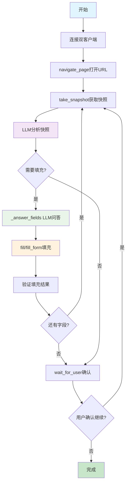

# RESUME_SKILL v2.4 开发进度

## 📅 开发日期
- **开始时间**: 2026年7月12日
- **版本**: v2.4 - Chrome DevTools MCP重构版
- **状态**: 🚧 开发中

## 🎯 开发目标

用Google chrome-devtools-mcp替代所有浏览器操作，用LLM问答替代字段匹配引擎，精简2000+行代码，提升可靠性。

### 核心改进
1. **Google MCP集成** - 使用官方chrome-devtools-mcp (29个工具)
2. **LLM问答替代匹配** - 用LLM直接理解和填充字段，无需三阶匹配引擎
3. **代码精简** - 删除field_matcher.py、browser_agent.py、form_extractor.py、form_filler.py
4. **架构简化** - 双服务器架构（我们的wait_for_user + Google的29个工具）

## 📋 开发阶段

### ✅ Phase 1: 安装chrome-devtools-mcp
**状态**: ✅ 完成

**完成内容**:
- ✅ Node.js v24.16.0已安装
- ✅ npx 11.12.1可用
- ✅ chrome-devtools-mcp@latest (v1.5.0)成功下载
- ✅ 验证headless模式启动
- ✅ 验证slim模式和完整模式

**验证命令**:
```bash
node --version  # v24.16.0
npx --version   # 11.12.1
npx chrome-devtools-mcp@latest --help  # 成功显示帮助
```

### ✅ Phase 2: 创建chrome_client.py
**状态**: ✅ 完成

**文件**: `src/resume_skill/agent/mcp/chrome_client.py`

**实现方式**:
- 使用简化版的subprocess通信（临时方案，用于开发）
- 支持headless模式
- 支持isolated模式（临时profile，用完自动清理）

**核心功能**:
```python
class ChromeDevToolsClient:
    def connect() -> None          # 建立连接
    def call_tool(name, params)    # 调用工具
    def close() -> None            # 关闭连接
```

**测试结果**:
- ✅ 连接成功
- ✅ 列出29个工具
- ✅ navigate_page成功导航到example.com
- ✅ take_snapshot成功获取页面快照
- ✅ take_screenshot成功截图
- ✅ evaluate_script成功执行JavaScript
- ✅ wait_for成功等待页面元素

**可用工具列表** (29个):
1. navigate_page - 导航到URL
2. take_snapshot - 获取a11y树快照
3. fill - 填充单个字段
4. fill_form - 批量填充表单
5. click - 点击元素
6. take_screenshot - 截图
7. list_pages - 列出页面
8. select_page - 选择页面
9. new_page - 打开新页面
10. close_page - 关闭页面
11. wait_for - 等待文本出现
12. evaluate_script - 执行JavaScript
13. hover - 悬停
14. press_key - 按键
15. type_text - 输入文本
16. upload_file - 上传文件
17. handle_dialog - 处理对话框
18. drag - 拖拽
19. emulate - 模拟设备
20. resize_page - 调整页面大小
21. lighthouse_audit - Lighthouse审计
22. performance_start_trace - 性能追踪开始
23. performance_stop_trace - 性能追踪停止
24. performance_analyze_insight - 性能分析
25. take_heapsnapshot - 堆快照
26. list_network_requests - 列出网络请求
27. get_network_request - 获取网络请求
28. list_console_messages - 列出控制台消息
29. get_console_message - 获取控制台消息

### ✅ Phase 3: 精简server.py / server_mcp.py
**状态**: ✅ 完成

#### server.py精简
**修改内容**:
- ✅ 删除不需要的导入（BrowserAgent、form_extractor、form_filler等）
- ✅ 删除with_timeout装饰器
- ✅ 删除全局变量（browser、_resume_path）
- ✅ 删除_get_page()函数
- ✅ 精简TOOL_HELP为只保留wait_for_user
- ✅ 删除所有cmd_*函数，只保留cmd_wait_for_user
- ✅ 精简TOOL_ROUTES为只保留wait_for_user和help

**精简后**:
```python
TOOL_HELP = {
    "wait_for_user": {
        "description": "等待用户手动操作（如登录），用户按下回车后继续",
        "params": {
            "message": {"type": "string", "description": "提示信息", "default": "请完成操作后按 Enter 继续..."},
        }
    },
}

TOOL_ROUTES = {
    "wait_for_user": cmd_wait_for_user,
    "help": lambda **kwargs: {"tools": {k: v["description"] for k, v in TOOL_HELP.items()}},
}
```

#### server_mcp.py精简
**修改内容**:
- ✅ 删除所有浏览器相关的导入
- ✅ 删除所有浏览器相关的工具函数
- ✅ 只保留wait_for_user工具

**精简后**:
```python
from mcp.server.fastmcp import FastMCP

mcp = FastMCP("resume-skill")

@mcp.tool()
def wait_for_user(message: str = "请完成操作后按 Enter 继续...") -> str:
    """等待用户手动操作（如登录），用户按下回车后继续"""
    input(message)
    return json.dumps({"status": "continue"}, ensure_ascii=False)

if __name__ == "__main__":
    mcp.run(transport="stdio")
```

### ⏳ Phase 4: 重写agent.py（进行中）
**状态**: 🚧 计划中

**计划内容**:
- 创建新的agent.py，使用双客户端架构
- Agent将同时连接两个MCP服务器：
  1. 我们的server.py（只有wait_for_user工具）
  2. Google的chrome-devtools-mcp（29个工具）
- 实现新的执行流程：
  1. take_snapshot获取页面快照
  2. _parse_snapshot解析快照
  3. _answer_fields用LLM问答确定字段填充
  4. fill()执行填充
  5. 循环直到完成

### ⏳ Phase 5: 删除旧文件（待执行）
**状态**: 📋 计划中

**待删除文件**:
- `src/resume_skill/agent/field_matcher.py` - LLM问答替代了三阶匹配
- `src/resume_skill/agent/browser_agent.py` - Google MCP替代了Playwright管理
- `src/resume_skill/agent/form_extractor.py` - take_snapshot替代了JS提取
- `src/resume_skill/agent/form_filler.py` - fill(uid, val)替代了九策略填充

**预计精简代码量**: ~2000行

## 🏗️ 新架构设计

### 双客户端架构
```
┌────────────────────────────────────────────────────┐
│              agent.py（LLM Agent 循环）              │
│                                                    │
│  flow: take_snapshot → _parse_snapshot →           │
│        _answer_fields(LLM Q&A) → fill() 循环       │
│                                                    │
│  工具池 = Google MCP 所有工具 + 我们的 wait_for_user │
└──┬────────────────────────────────────┬────────────┘
                                    │                                    ▼
┌─────────────────────┐    ┌──────────────────────┐
│ 我们的 server.py     │    │ chrome-devtools-mcp  │
│ (精简为 1 个工具)    │    │ (Google, npx 启动)   │
│                     │    │                      │
│ wait_for_user       │    │ navigate_page        │
│                     │    │ take_snapshot        │
│                     │    │ fill(uid, val)       │
│                     │    │ click(uid)           │
│                     │    │ take_screenshot      │
│                     │    │ evaluate_script      │
│                     │    │ ... 29 tools         │
└─────────────────────┘    └──────────────────────┘
```

### 新的执行流程


## 🧪 测试结果

### chrome_client.py测试
**测试文件**: `tests/test_chrome_full.py`

**测试结果**: ✅ 全部通过
```
✅ 连接成功
✅ 页面列表: 1: about:blank
✅ 导航到example.com成功
✅ 等待页面加载成功
✅ 获取快照成功 (361字符)
✅ 截图成功
✅ JavaScript执行成功，返回: "Example Domain"
```

### 工具列表验证
**测试文件**: `tests/list_chrome_tools.py`

**结果**: ✅ 成功获取29个工具

## 📝 开发笔记

### 技术要点
1. **chrome-devtools-mcp启动方式**:
   - Windows需要使用`shell=True`
   - 使用`--isolated`确保每次启动使用临时profile
   - 使用`--headless`运行无头模式

2. **MCP协议通信**:
   - 使用JSON-RPC 2.0协议
   - 需要先发送initialize请求
   - 工具调用使用tools/call方法

3. **Python环境要求**:
   - 需要conda环境: `resume-skill-v24`
   - Python 3.11+（推荐）
   - 已安装mcp>=1.0包

### 遇到的问题及解决
1. **问题**: Windows subprocess.Popen找不到npx
   **解决**: 使用`shell=True`参数

2. **问题**: MCP SDK连接复杂，asyncio.run()有问题
   **解决**: 使用简化的subprocess通信方式

3. **问题**: server_mcp.py中`@mcp.tool(timeout=30)`报错
   **解决**: 删除timeout参数，新版MCP SDK不支持

## 🚀 下一步计划

1. ⏳ **重写agent.py**:
   - 实现双客户端架构
   - 集成chrome_client和传统MCPClient
   - 实现LLM问答填充流程

2. ⏳ **创建新的测试用例**:
   - 测试完整表单填充流程
   - 测试LLM问答匹配功能
   - 测试双客户端协同工作

3. ⏳ **删除旧文件**:
   - 删除field_matcher.py等4个文件
   - 更新__init__.py导入
   - 更新README.md文档

4. ⏳ **性能优化**:
   - 对比v2.3和v2.4的性能
   - 测试并发填充能力
   - 优化LLM调用次数

## 📊 预期收益

### 代码量对比
| 版本 | 总代码量 | 浏览器操作 | 字段匹配 | 预计精简 |
|:---|:---:|:---:|:---:|:---:|
| v2.3 | ~3000行 | ~800行 | ~600行 | - |
| v2.4 | ~1400行 | 0行（使用MCP） | 0行（使用LLM） | **~1600行** |

### 可靠性提升
- ✅ 使用官方维护的chrome-devtools-mcp（Google维护）
- ✅ 标准MCP协议，减少自定义协议风险
- ✅ 简化架构，减少维护成本
- ✅ 更好的浏览器兼容性（Chrome官方支持）

### 性能预期
- 🚀 字段提取：快照方式比JS提取更快
- 🚀 LLM问答：减少三阶匹配的复杂逻辑
- 🚀 批量填充：fill_form工具支持批量操作

---

*文档更新: 2026年7月12日*
*状态: 🚧 开发中 - Phase 1-3已完成，Phase 4进行中*